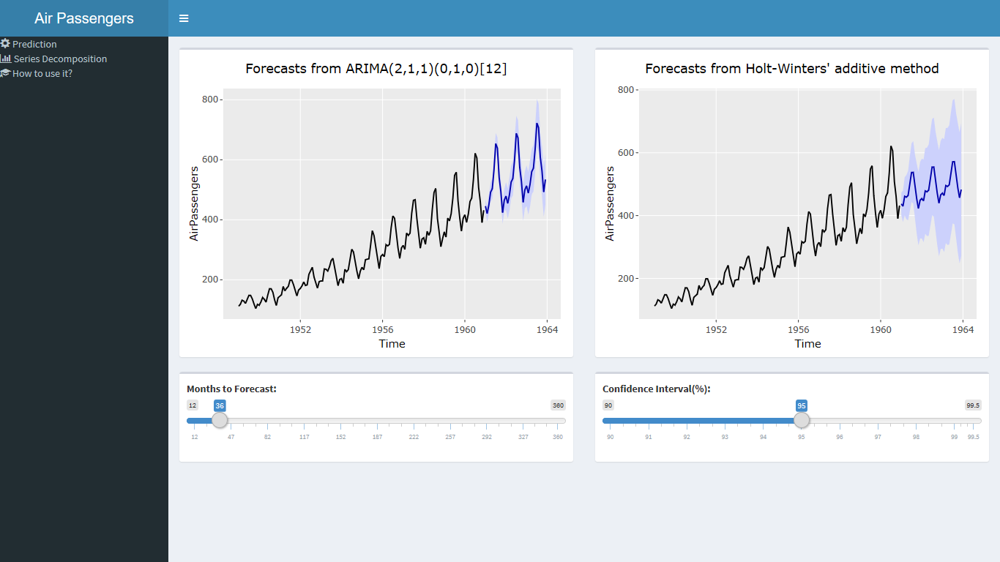
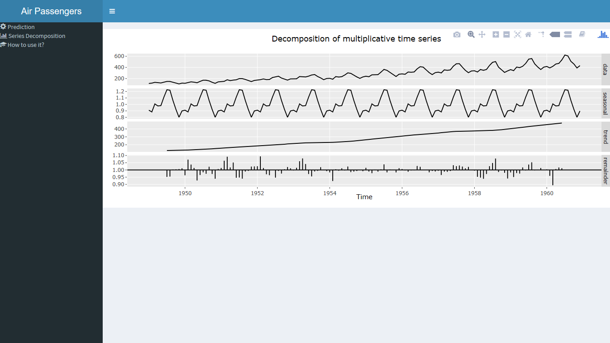

```{r setup, include=FALSE}
knitr::opts_chunk$set(echo = FALSE)
```

## Overview

This document presents the shiny application developed as project to **Coursera Developing Data Products**.

The application forecasts the passengers who will take a flight in the next months of the study dates of **AirPassengers** data set.

You can use it by clicking [here](https://jmpenyas.shinyapps.io/DevelopingDataProductsProject/).

The presentation style and CSS used was found at [garrettgman's github](https://github.com/rstudio/ShinyDeveloperConference/tree/master/Reactivity)

## Interface - Prediction

Clicking on *Prediction* menu, you can forecast the data, changing the prediction period and the confidence interval with the sliders.


## Interface - Series Decomposition

This tab is merely informative and shows the Time Series Decomposition of the choosen data set.



## Reproducible Code
This page will how the [code](https://github.com/jmpenyas/Developing-Data-Products-Project) used on server shiny file to allow to be reproduced by anybody who wants it. 

```{r 1, echo=TRUE, message=FALSE, results='hide', fig.show='hide'}
library(forecast)
library(ggplot2)
library(plotly)
arimaModel <-  auto.arima(AirPassengers)
predArima <- forecast(arimaModel, level = 95, h = 36)
ggplotly(autoplot(predArima))
modelHw <-
      hw(
            AirPassengers,
            initial = "optimal",
            h = 36,
            level = c(95)
      )
ggplotly(autoplot(modelHw))
decomp <- decompose(AirPassengers, type = "multiplicative")
autoplot(decomp) 
```


